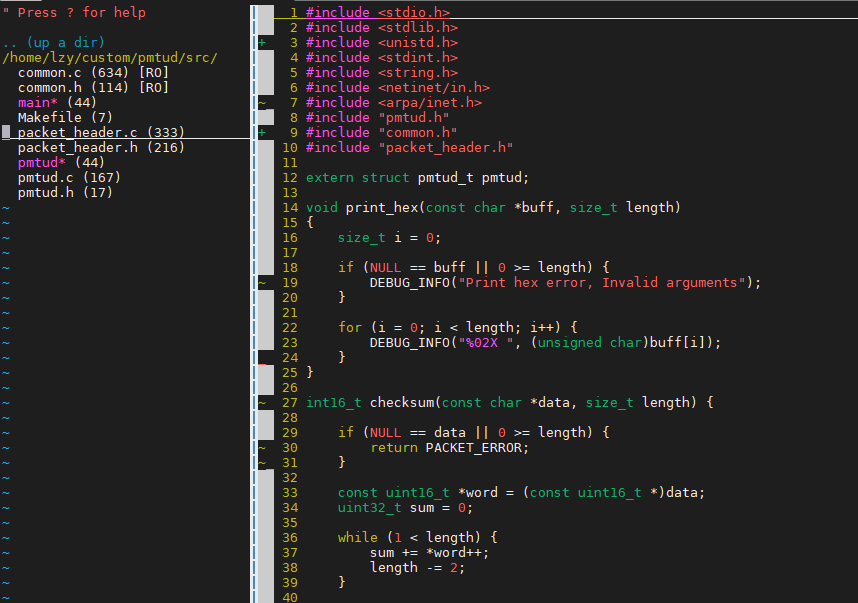
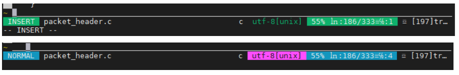
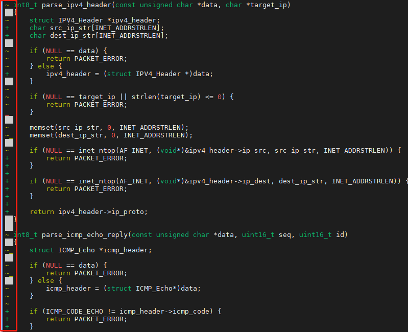
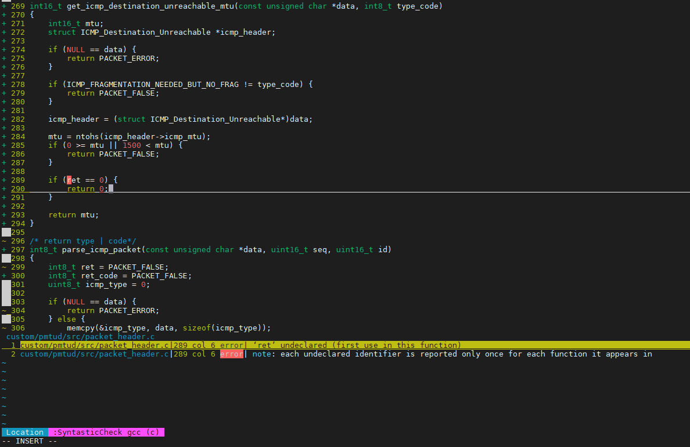
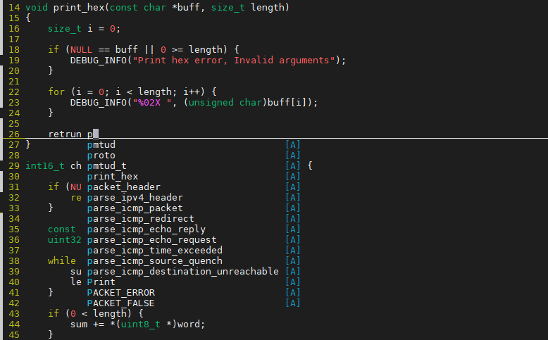

## Vimer Notes
[TOC]
------

### 1. 简介

作为一名vimer，此笔记主要是向大家分享一下个人的vimrc配置，以及实用的插件和插件安装的方式步骤。

- **vim** 强大之处在于其模式编辑功能，主要包括普通模式、插入模式和命令模式等。Vim 还支持宏、窗口分割、标签和丰富的插件体系，vim 总体来说加载速度也快一些（说的就是比vscode 快）。

- **vimrc** 文件是 Vim 的配置文件，存放在用户的主目录下。该文件允许用户定制 Vim 的行为和外观，包括键绑定、插件选项、UI 设置和更多高级特性。.vimrc 文件在保存后自动生效，每次Vim 启动时自动读取。

- **[vim-plug](https://github.com/junegunn/vim-plug)** 是Vim 插件管理器，可以快速地安装、更新和卸载插件。目前体验过比较好用的插件是目录树（nerdtree），状态栏（vim-airline），基于git文件修改状态（gitgutter），语法检查（syntastic），代码补全（coc.nvim）。

------

### 2. vimrc 配置

#### 2.1 编辑器

```bash
" tab缩进设置
set tabstop=4       " 设置制表符占用的空格数
set shiftwidth=4    " 设置缩进级别的空格数
set autoindent		" 换行自动缩进
set expandtab       " 将制表符转换为相应数量的空格

" 搜索设置
set ignorecase      " 搜索时忽略大小写
set hlsearch        " 高亮显示搜索结果

" 编码格式
set encoding=utf-8  " 设置文件编码为 UTF-8

" 自动命令
autocmd BufWritePre * %s/\s\+$//e  " 保存文件前删除行尾空格
```

#### 2.2 用户界面

```bash
" 颜色方案
	" 1. 首先确定vim是否支持颜色方案
	:version -> +syntax
	" 2. 选择试用颜色方案
	:colorscheme [tab] -> 会跳出可用的方案
	" 3.确定方案后添加到.vimrc
	colorscheme peachpuff/koehler

" 行号显示
set number 

" 缩进提示
set list lcs=tab:\|\    " 最后是空格

" 光标显示
set cursorline			" 光标所在行高亮
set cursorcolumn		" 光标所在列高亮

" 字体大小
set guifont=Monaco:h12

" 折叠函数体
set foldmethod=syntax
```

#### 2.3  括号匹配

```bash
inoremap ( ()<Esc>i		
inoremap { {}<Esc>i
inoremap [ []<Esc>i
inoremap " ""<Esc>i
inoremap ' ''<Esc>i
```

------

### 3. vim-plug 插件管理器

#### 3.1 .vim目录

|         Dir          |           Describe           |
| :------------------: | :--------------------------: |
| **~/.vim/autoload/** | 使用时才被自动加载运行的文件 |
|  **~/.vim/colors/**  |         vim配色方案          |
|  **~/.vim/plugin/**  |        启动运行的插件        |
|  **~/.vim/syntax/**  |         语法描述脚本         |
|   **~/.vim/doc/**    |        为插件放置文档        |
| **~/.vim/ftdetect/** |     检测和设置文件的类型     |
| **~/.vim/ftplugin/** |  用于特定文件类型的插件文件  |
|  **~/.vim/after/**   |      每次启动的时候加载      |
|  **~/.vim/spell/**   |         拼写检查脚本         |

#### 3.2 安装vim-plug

- 下载plug.vim，完成后会在.vim/autoload生成plug.vim文件


```bash
curl -fLo ~/.vim/autoload/plug.vim --create-dirs https://raw.githubusercontent.com/junegunn/vim-plug/master/plug.vim
```

- 添加.vimrc配置


```bash
call plug#begin('~/.vim/plugged')
Plug '插件url'
call plug#end()
```

- 加载.vimrc配置

```bash
:source ~/.vimrc
```

- 安装插件


```
:PlugInstall
```

- 更新插件


```
:PlugUpdate
```

------

### 4. vim插件

#### 4.1 [nerdtree](https://github.com/preservim/nerdtree)

`nerdtree`是目录树插件，可在vim中打开可视化树形目录结构，并且可以直接选择文件进行跳转。

安装方式`nerdtree`插件可直接依靠`vim-plug`安装：

- 配置vim-plug

	```bash
	call plug#begin('~/.vim/plugged')
	Plug 'preservim/nerdtree'
	call plug#end()
	```

- 安装插件

	```bash
	:PlugInstall
	```

- 个人配置

	```bash
	nnoremap <leader>n :NERDTreeFocus<CR>
	nnoremap <C-q> :NERDTree<CR>
	nnoremap <C-w> :NERDTreeToggle<CR>
	nnoremap <C-e> :NERDTreeFind<CR>
	let g:NERDTreeFileLines = 1
	
	autocmd BufEnter * if winnr('$') == 1 && exists('b:NERDTree') && b:NERDTree.isTabTree() | q    uit | endif
	```

- 插件效果
    

#### 4.2 **[vim-airline](https://github.com/vim-airline/vim-airline)**

`vim-airline`插件可在状态栏上显示丰富的信息，包括但不限于文件名、文件类型、文件编码、位置信息行号和列号、Git 分支、修改状态、诊断信息等。

安装`airline`插件可直接依靠`vim-plug`安装：

- 配置vim-plug

	```bash
	call plug#begin('~/.vim/plugged')
	Plug 'vim-airline/vim-airline'
	call plug#end()
	```

- 安装插件

	```bash
	:PlugInstall
	```

- 个人配置

	```bash
	set laststatus=2
	let g:airline_theme='tomorrow'
	```

- 插件效果
    

#### 4.3 [vim-airline-themes](https://github.com/vim-airline/vim-airline-themes)

`vim-airline-themes`是 `vim-airline` 的一个配套插件，专门提供了一系列美观的主题，用于定制和增强 `vim-airline` 状态栏的外观。这个插件包含了多种颜色方案和样式。

安装`vim-airline-themes`也可直接依靠`vim-plug`安装：

- 配置vim-plug

	```bash
	call plug#begin('~/.vim/plugged')
	Plug 'vim-airline/vim-airline-themes'
	call plug#end()
	```

- 安装插件

	```bash
	:PlugInstall
	```

#### 4.4  **[vim-gitgutter](https://github.com/airblade/vim-gitgutter)**

`vim-gitutter` 插件，它在编辑器的符号栏（sign column）中显示 Git 差异指示器，即在代码旁边显示行的添加、修改或删除。能够直观地看到自己的更改与 Git 仓库的现有版本之间的差异。

安装`vim-gitutter`也可直接依靠`vim-plug`安装：

- 配置vim-plug

	```bash
	call plug#begin('~/.vim/plugged')
	Plug 'airblade/vim-gitgutter'
	call plug#end()
	```

- 安装插件

	```bash
	:PlugInstall
	```

- 个人配置

	```bash
	highlight SignColumn      guibg=#000000 ctermbg=7   " 设置符号列
	highlight GitGutterAdd    guifg=#009900 ctermfg=2
	highlight GitGutterChange guifg=#bbbb00 ctermfg=3
	highlight GitGutterDelete guifg=#ff2222 ctermfg=1
	```

- 插件效果
    

#### 4.5 [syntastic](https://github.com/vim-syntastic/syntastic)

`sysntastic`是Vim语法检查插件，可在状态栏下方显示产生的语法错误。触发检查在保存文件后自动执行，可以在编译前提前改正语法错误。对于c/c++，检查标准可以选择GCC、Clang、cppcheck；对于 Python，它可以集成 Pylint、flake8、mypy 等，这些工具不仅检查语法错误，还可以检查代码风格、复杂度、类型注解等。

安装`syntastic`可依靠vim-plug安装：

- 配置vim-plug

	```bash
	call plug#begin('~/.vim/plugged')
	Plug 'vim-syntastic/syntastic'
	call plug#end()
	```

- 安装插件

	```bash
	:PlugInstall
	```

- 个人配置

  ```bash
  set statusline+=%#warningmsg#
  set statusline+=%{SyntasticStatuslineFlag()}
  set statusline+=%*
  let g:syntastic_always_populate_loc_list = 1
  let g:syntastic_auto_loc_list = 1
  let g:syntastic_check_on_open = 1
  let g:syntastic_check_on_wq = 0
  
  let g:syntastic_c_checkers = ['gcc']
  let g:syntastic_cpp_checkers = ['gcc']
  let g:syntastic_c_gcc_args = '-Wall'
  let g:syntastic_cpp_gcc_args = '-Wall'
  ```

- 插件效果
    

#### 4.6 [coc.nvim](https://github.com/neoclide/coc.nvim)

`coc.nvim`是vim自动补全的插件，安装较`YouCompleteMe`来说更简单。

安装`coc.nvim`之前，需要安装一些依赖项：

- 安装`node.js` `npm`

	```bash
	sudo yum install nodejs npm
	```

- 编译安装依赖

	```bash
	cd ~/.vim/plugged/coc.nvim
	npm ci
	```

解决完依赖问题，可以通过vim-plug安装插件：

- 配置vim-plug

	```bash
	call plug#begin('~/.vim/plugged')
	Plug 'neoclide/coc.nvim', {'branch': 'release'}
	call plug#end()
	```

- 安装插件

	```bash
	:PlugInstall
	```

- 个人配置

	```bash
	inoremap <expr> <Tab> pumvisible() ? "\<C-n>" : "\<Tab>"
	inoremap <expr> <S-Tab> pumvisible() ? "\<C-p>" : "\<S-Tab>"
	```

- 插件效果
    

#### 4.7 [YouCompleteMe](https://github.com/ycm-core/YouCompleteMe)

`YouCompleteMe` 是vim的自动补全插件,但`YouCompleteMe`的安装比较复杂，不能单靠`vim-plug`来自动安装。

安装`YouCompleteMe`之前需要先安装一些依赖项( 以**CentOS 7.9**为例 )：

- 安装`vim 8.2.3995`版本

  ```bash
  # 下载 Vim 的源代码
  cd ~
  git clone https://github.com/vim/vim.git
  
  # 编译并安装 Vim：
  cd vim
  ./configure --with-features=huge \
              --enable-multibyte \
              --enable-python3interp=yes \
              --with-python3-config-dir=$(python3-config --configdir) \
              --enable-cscope \
              --prefix=/usr/local
  make
  sudo make install
  
  # 检查版本
  vim --version
  ```

- 安装`python 3.8`

	```bash
	# 安装scl仓库
	sudo yum install centos-release-scl
	
	# 安装python3.8
	sudo yum install rh-python38
	
	# 启用python3.8环境
	scl enable rh-python38 bash
	
	# 安装python3.8开发包
	sudo yum install rh-python38-python-devel
	```

- 安装`cmake 3.14 `

	[^备注]: 由于CentOS 7 仓库提供的Cmake版本不够新，只能通过源代码编译升级

	```bash
	# 下载解压Cmake
	cd /tmp
	wget https://github.com/Kitware/CMake/releases/download/v3.21.1/cmake-3.21.1-linux-x86_64.tar.gz
	tar -zxvf cmake-3.21.1-linux-x86_64.tar.gz
	
	# 将二进制文件移动到全局文件
	sudo mv /tmp/cmake-3.21.1-linux-x86_64 /opt/cmake-3.21.1
	sudo ln -s /opt/cmake-3.21.1/bin/* /usr/local/bin/
	
	# 检查cmake版本
	cmake --version
	```

- 安装支持`c++17的gcc`

	```bash
	# 安装scl仓库以及devtoolset-8
	sudo yum install centos-release-scl
	sudo yum install devtoolset-8
	
	# 启用 devtoolset-8，以便使用更新的 GCC 版本
	scl enable devtoolset-8 bash
	```

解决依赖问题，就可以正式安装`YouCompletMe`插件:

- 配置vim-plug

	```bash
	call plug#begin('~/.vim/plugged')
	Plug 'ycm-core/YouCompleteMe'
	call plug#end()
	```

- 安装插件

	```bash
	:PlugInstall
	```

- 编译`YouCompleteMe`

	```bash
	cd ~/.vim/plugged/YouCompleteMe
	python3 install.py --all
	```
